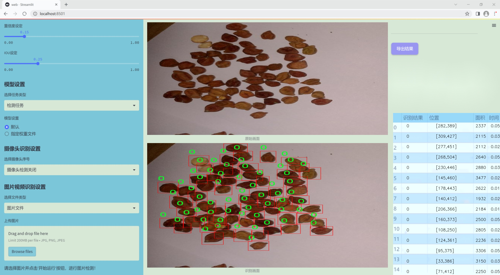
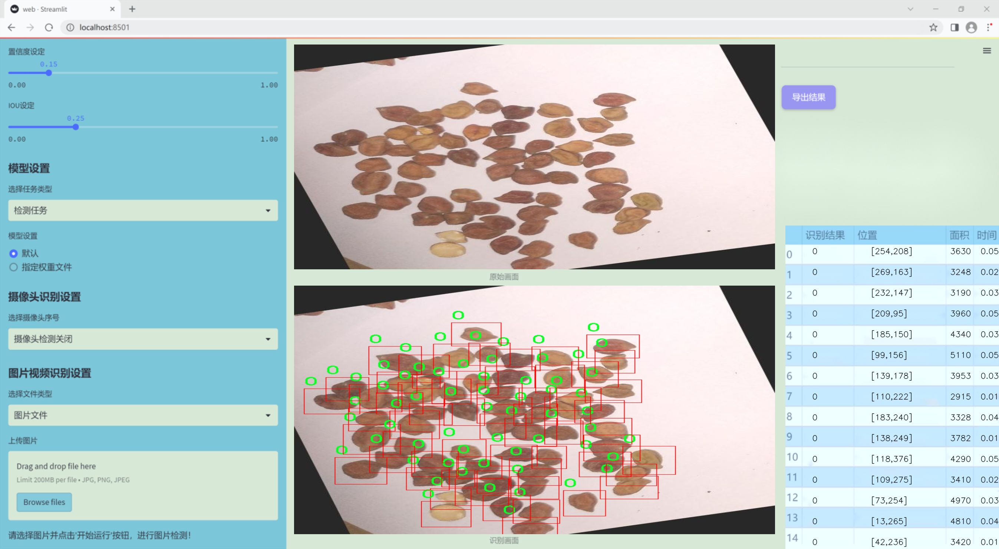
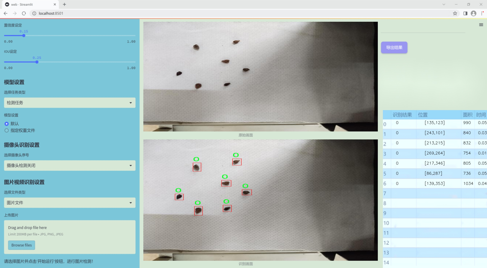
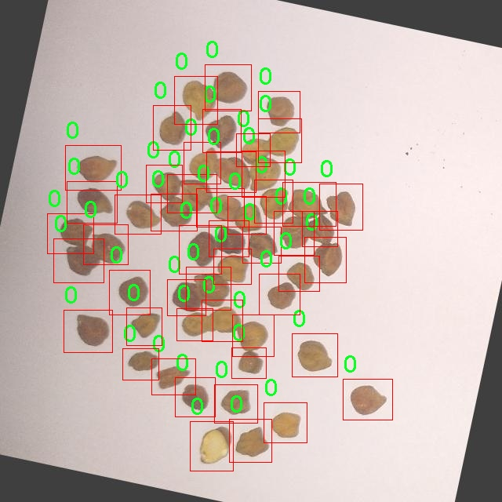
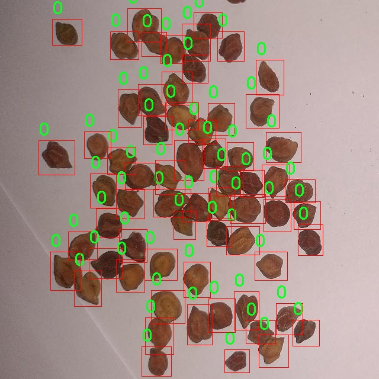
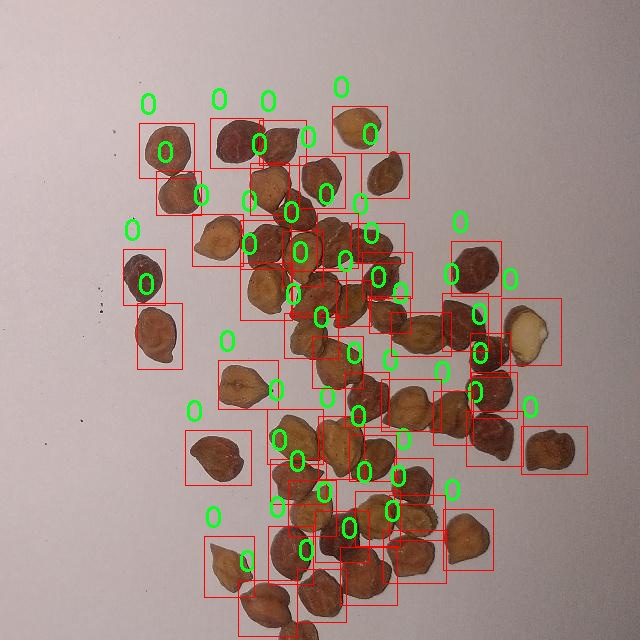
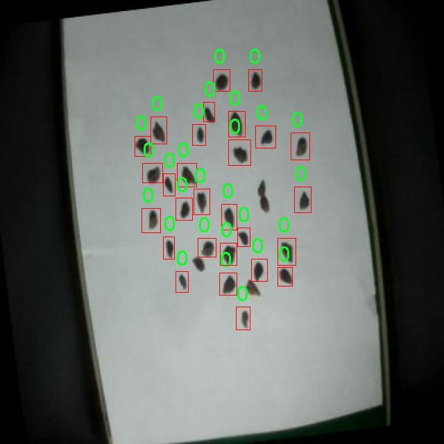
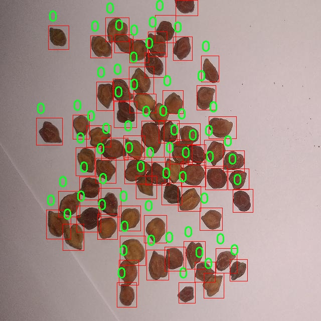

### 1.背景意义

研究背景与意义

随着全球人口的不断增长，农业生产面临着日益严峻的挑战。种子作为农业生产的基础，其质量和种类直接影响到作物的产量和品质。因此，开发高效的种子检测系统对于提高农业生产效率、保障粮食安全具有重要意义。近年来，计算机视觉技术的迅猛发展为种子检测提供了新的解决方案。基于深度学习的目标检测算法，尤其是YOLO（You Only Look Once）系列，因其高效性和准确性，逐渐成为种子检测领域的研究热点。

本研究旨在基于改进的YOLOv11算法，构建一个高效的种子检测系统。通过对特定种子图像数据集的分析与处理，我们希望能够实现对种子的自动识别与分类。该数据集包含100张经过精确标注的种子图像，类别数量为1，主要集中在特定类型的种子上。这一单一类别的设计，使得模型在训练过程中能够更专注于特定特征的学习，从而提高检测的准确性和鲁棒性。

此外，数据集在预处理阶段进行了自动方向调整和尺寸缩放，确保了输入数据的一致性和适应性。尽管未采用图像增强技术，但通过YOLOv11的改进算法，我们依然能够在现有数据基础上实现良好的检测效果。通过对种子图像的深入分析与学习，该系统不仅能够提高种子检测的效率，还能够为农业生产提供科学依据，推动智能农业的发展。

综上所述，基于改进YOLOv11的种子检测系统不仅具有重要的理论研究价值，还有助于实际应用中的种子质量监测与管理，为农业现代化提供技术支持。

### 2.视频效果

[2.1 视频效果](https://www.bilibili.com/video/BV1KEUnYwEpu/)

### 3.图片效果







##### [项目涉及的源码数据来源链接](https://kdocs.cn/l/cszuIiCKVNis)**

注意：本项目提供训练的数据集和训练教程,由于版本持续更新,暂不提供权重文件（best.pt）,请按照6.训练教程进行训练后实现上图演示的效果。

### 4.数据集信息

##### 4.1 本项目数据集类别数＆类别名

nc: 1
names: ['0']


该项目为【目标检测】数据集，请在【训练教程和Web端加载模型教程（第三步）】这一步的时候按照【目标检测】部分的教程来训练

##### 4.2 本项目数据集信息介绍

本项目数据集信息介绍

本项目所使用的数据集旨在支持改进YOLOv11的种子检测系统，具体聚焦于“semillas_seleccionadas”这一主题。该数据集的设计初衷是为了解决种子识别和分类中的关键问题，尤其是在农业和植物科学领域中，准确的种子检测对于作物管理和育种工作至关重要。数据集中包含的类别数量为1，类别列表仅包含一个标识符“0”，这表明该数据集专注于一种特定类型的种子。这种简化的类别设置有助于系统在训练过程中更好地聚焦于目标对象，从而提高检测精度。

在数据集的构建过程中，采集了大量的种子图像，这些图像涵盖了不同的环境条件、光照变化以及种子在不同背景下的表现。这种多样性确保了模型在实际应用中能够适应各种复杂情况，提升其鲁棒性。此外，数据集中的图像经过精心标注，确保每一张图像中的种子位置和特征都得到了准确的描述。这种高质量的标注为YOLOv11模型的训练提供了坚实的基础，使其能够学习到种子的特征并在检测时做出准确的判断。

在训练过程中，数据集将被划分为训练集和验证集，以便于对模型的性能进行评估和调整。通过不断的迭代训练，期望最终能够实现一个高效、准确的种子检测系统，为农业生产提供技术支持。整体而言，本项目的数据集不仅为YOLOv11的改进提供了必要的数据基础，也为未来在种子检测领域的研究奠定了良好的基础。











### 5.全套项目环境部署视频教程（零基础手把手教学）

[5.1 所需软件PyCharm和Anaconda安装教程（第一步）](https://www.bilibili.com/video/BV1BoC1YCEKi/?spm_id_from=333.999.0.0&vd_source=bc9aec86d164b67a7004b996143742dc)


[5.2 安装Python虚拟环境创建和依赖库安装视频教程（第二步）](https://www.bilibili.com/video/BV1ZoC1YCEBw?spm_id_from=333.788.videopod.sections&vd_source=bc9aec86d164b67a7004b996143742dc)

### 6.改进YOLOv11训练教程和Web_UI前端加载模型教程（零基础手把手教学）

[6.1 改进YOLOv11训练教程和Web_UI前端加载模型教程（第三步）](https://www.bilibili.com/video/BV1BoC1YCEhR?spm_id_from=333.788.videopod.sections&vd_source=bc9aec86d164b67a7004b996143742dc)


按照上面的训练视频教程链接加载项目提供的数据集，运行train.py即可开始训练



     Epoch   gpu_mem       box       obj       cls    labels  img_size
     1/200     20.8G   0.01576   0.01955  0.007536        22      1280: 100%|██████████| 849/849 [14:42<00:00,  1.04s/it]
               Class     Images     Labels          P          R     mAP@.5 mAP@.5:.95: 100%|██████████| 213/213 [01:14<00:00,  2.87it/s]
                 all       3395      17314      0.994      0.957      0.0957      0.0843

     Epoch   gpu_mem       box       obj       cls    labels  img_size
     2/200     20.8G   0.01578   0.01923  0.007006        22      1280: 100%|██████████| 849/849 [14:44<00:00,  1.04s/it]
               Class     Images     Labels          P          R     mAP@.5 mAP@.5:.95: 100%|██████████| 213/213 [01:12<00:00,  2.95it/s]
                 all       3395      17314      0.996      0.956      0.0957      0.0845

     Epoch   gpu_mem       box       obj       cls    labels  img_size
     3/200     20.8G   0.01561    0.0191  0.006895        27      1280: 100%|██████████| 849/849 [10:56<00:00,  1.29it/s]
               Class     Images     Labels          P          R     mAP@.5 mAP@.5:.95: 100%|███████   | 187/213 [00:52<00:00,  4.04it/s]
                 all       3395      17314      0.996      0.957      0.0957      0.0845


###### [项目数据集下载链接](https://kdocs.cn/l/cszuIiCKVNis)

### 7.原始YOLOv11算法讲解


##### YOLO11介绍

Ultralytics YOLO11是一款尖端的、最先进的模型，它在之前YOLO版本成功的基础上进行了构建，并引入了新功能和改进，以进一步提升性能和灵活性。
**YOLO11设计快速、准确且易于使用，使其成为各种物体检测和跟踪、实例分割、图像分类以及姿态估计任务的绝佳选择。**


**结构图如下：**


##### **C3k2**

**C3k2，结构图如下**


**C3k2，继承自类`C2f，其中通过c3k设置False或者Ture来决定选择使用C3k还是`**Bottleneck


**实现代码** **ultralytics/nn/modules/block.py**

##### C2PSA介绍

**借鉴V10 PSA结构，实现了C2PSA和C2fPSA，最终选择了基于C2的C2PSA（可能涨点更好？）**


**实现代码** **ultralytics/nn/modules/block.py**

##### Detect介绍

**分类检测头引入了DWConv（更加轻量级，为后续二次创新提供了改进点），结构图如下（和V8的区别）：**


### 8.200+种全套改进YOLOV11创新点原理讲解

#### 8.1 200+种全套改进YOLOV11创新点原理讲解大全

由于篇幅限制，每个创新点的具体原理讲解就不全部展开，具体见下列网址中的改进模块对应项目的技术原理博客网址【Blog】（创新点均为模块化搭建，原理适配YOLOv5~YOLOv11等各种版本）

[改进模块技术原理博客【Blog】网址链接](https://gitee.com/qunmasj/good)


#### 8.2 精选部分改进YOLOV11创新点原理讲解

###### 这里节选部分改进创新点展开原理讲解(完整的改进原理见上图和[改进模块技术原理博客链接](https://gitee.com/qunmasj/good)【如果此小节的图加载失败可以通过CSDN或者Github搜索该博客的标题访问原始博客，原始博客图片显示正常】
### 可变性卷积DCN简介
卷积神经网络由于其构建模块中固定的几何结构，本质上受限于模型几何变换。为了提高卷积神经网络的转换建模能力，《Deformable Convolutional Networks》作者提出了两个模块：可变形卷积（deformable convolution）和可变形RoI池（deformable RoI pooling）。这两个模块均基于用额外的偏移来增加模块中的空间采样位置以及从目标任务中学习偏移的思想，而不需要额外的监督。

第一次证明了在深度神经网络中学习密集空间变换（dense spatial transformation）对于复杂的视觉任务是有效的

视觉识别中的一个关键挑战是如何适应对象比例、姿态、视点和零件变形中的几何变化或模型几何变换。一般有两种方法实现：
1）建立具有足够期望变化的训练数据集。这通常通过增加现有的数据样本来实现，例如通过仿射变换。但是训练成本昂贵而且模型参数庞大。
2）使用变换不变（transformation-invariant）的特征和算法。比如比较有名的SIFT(尺度不变特征变换)便是这一类的代表算法。

但以上的方法有两个缺点：
1）几何变换被假定为固定的和已知的，这些先验知识被用来扩充数据，设计特征和算法。为此，这个假设阻止了对具有未知几何变换的新任务的推广，从而导致这些几何变换可能没有被正确建模。
2）对于不变特征和算法进行手动设计，对于过于复杂的变换可能是困难的或不可行的。

卷积神经网络本质上局限于模拟大型未知转换。局限性源于CNN模块的固定几何结构：卷积单元在固定位置对输入特征图进行采样；池化层以固定比率降低特征矩阵分辨率；RoI（感兴趣区域）池化层将RoI分成固定的空间箱（spatial bins）等。缺乏处理几何变换的内部机制。

这种内部机制的缺乏会导致一些问题，举个例子。同一个CNN层中所有激活单元的感受野大小是相同的，但是这是不可取的。因为不同的位置可能对应于具有不同尺度或变形的对象，所以尺度或感受野大小的自适应确定对于具有精细定位的视觉识别是渴望的。

对于这些问题，作者提出了两个模块提高CNNs对几何变换建模的能力。


deformable convolution（可变形卷积）
将2D偏移量添加到标准卷积中的常规网格采样位置，使得采样网格能够自由变形。通过额外的卷积层，从前面的特征映射中学习偏移。因此，变形采用局部、密集和自适应的方式取决于输入特征。


deformable RoI pooling（可变形RoI池化）
为先前RoI池化的常规库（bin）分区中的每个库位置（bin partition）增加了一个偏移量。类似地，偏移是从前面的特征图和感兴趣区域中学习的，从而能够对具有不同形状的对象进行自适应部件定位（adaptive part localization）。

#### Deformable Convolutional Networks
Deformable Convolution
2D卷积由两个步骤组成：
1）在输入特征图x xx上使用规则网格R RR进行采样。
2）把这些采样点乘不同权重w ww后相加。

网格R定义感受野大小和扩张程度，比如内核大小为3x3，扩张程度为1的网格R可以表示为：
R = { ( − 1 , − 1 ) , ( − 1 , 0 ) , … , ( 0 , 1 ) , ( 1 , 1 ) } R = \{(-1,-1),(-1,0),\dots,(0,1),(1,1)\}
R={(−1,−1),(−1,0),…,(0,1),(1,1)}

​
 一般为小数，使用双线性插值进行处理。（把小数坐标分解到相邻的四个整数坐标点来计算结果）


具体操作如图所示：


首先对输入特征层进行一个普通的3x3卷积处理得到偏移域（offset field）。偏移域特征图具有与输入特征图相同的空间分辨率，channels维度2N对应于N个2D（xy两个方向）偏移。其中的N是原输入特征图上所具有的N个channels，也就是输入输出channels保持不变，这里xy两个channels分别对输出特征图上的一个channels进行偏移。确定采样点后就通过与相对应的权重w点乘相加得到输出特征图上该点最终值。

前面也提到过，由于这里xy两个方向所训练出来的偏移量一般来说是一个小数，那么为了得到这个点所对应的数值，会采用双线性插值的方法，从最近的四个邻近坐标点中计算得到该偏移点的数值，公式如下：


具体推理过程见：双线性插值原理

#### Deformable RoI Poolingb
所有基于区域提议（RPN）的对象检测方法都使用RoI池话处理，将任意大小的输入矩形区域转换为固定大小的特征图。


 一般为小数，需要使用双线性插值进行处理。


具体操作如图所示：


当时看这个部分的时候觉得有些突兀，明明RoI池化会将特征层转化为固定尺寸的区域。其实，我个人觉得，这个部分与上述的可变性卷积操作是类似的。这里同样是使用了一个普通的RoI池化操作，进行一些列处理后得到了一个偏移域特征图，然后重新作用于原来的w × H w \times Hw×H的RoI。只不过这里不再是规律的逐行逐列对每个格子进行池化，而是对于格子进行偏移后再池化处理。

#### Postion﹣Sensitive RoI Pooling
除此之外，论文还提出一种PS RoI池化（Postion﹣Sensitive RoI Pooling）。不同于上述可变形RoI池化中的全连接过程，这里使用全卷积替换。

具体操作如图所示：


首先，对于原来的特征图来说，原本是将输入特征图上的RoI区域分成k × k k\times kk×k个bin。而在这里，则是将输入特征图进行卷积操作，分别得到一个channels为k 2 ( C + 1 ) k^{2}(C+1)k (C+1)的得分图（score maps）和一个channels为2 k 2 ( C + 1 ) 2k{2}(C+1)2k 2 (C+1)的偏移域（offset fields），这两个特征矩阵的宽高是与输入特征矩阵相同的。其中，得分图的channels中，k × k k \times kk×k分别表示的是每一个网格，C CC表示的检测对象的类别数目，1表示背景。而在偏移域中的2表示xy两个方向的偏移。
也就是说，在PS RoI池化中，对于RoI的每一个网格都独自占一个通道形成一层得分图，然后其对于的偏移量占两个通道。offset fields得到的偏移是归一化后的偏移，需要通过和deformable RoI pooling中一样的变换方式得到∆ p i j ∆p_{ij}∆p ij，然后对每层得分图进行偏移池化处理。最后处理完的结果就对应着最后输出的一个网格。所以其包含了位置信息。

原文论述为：


#### Understanding Deformable ConvNets
当可变形卷积叠加时，复合变形的效果是深远的。如图所示：


ps：a是标准卷积的固定感受野，b是可变形卷积的适应性感受野。

感受野和标准卷积中的采样位置在整个顶部特征图上是固定的(左)。在可变形卷积中，它们根据对象的比例和形状进行自适应调整(右)。


### 9.系统功能展示

图9.1.系统支持检测结果表格显示

  图9.2.系统支持置信度和IOU阈值手动调节

  图9.3.系统支持自定义加载权重文件best.pt(需要你通过步骤5中训练获得)

  图9.4.系统支持摄像头实时识别

  图9.5.系统支持图片识别

  图9.6.系统支持视频识别

  图9.7.系统支持识别结果文件自动保存

  图9.8.系统支持Excel导出检测结果数据


### 10. YOLOv11核心改进源码讲解

#### 10.1 FreqFusion.py

以下是对代码中最核心部分的分析和详细中文注释：

```python
import torch
import torch.nn as nn
import torch.nn.functional as F

class FreqFusion(nn.Module):
    def __init__(self,
                 channels,
                 scale_factor=1,
                 lowpass_kernel=5,
                 highpass_kernel=3,
                 encoder_kernel=3,
                 compressed_channels=64,
                 align_corners=False,
                 feature_resample=False,
                 use_high_pass=True,
                 use_low_pass=True,
                 hr_residual=True,
                 semi_conv=True,
                 hamming_window=True):
        super().__init__()
        hr_channels, lr_channels = channels
        self.scale_factor = scale_factor
        self.lowpass_kernel = lowpass_kernel
        self.highpass_kernel = highpass_kernel
        self.compressed_channels = (hr_channels + lr_channels) // 8
        
        # 压缩高分辨率和低分辨率特征通道
        self.hr_channel_compressor = nn.Conv2d(hr_channels, self.compressed_channels, 1)
        self.lr_channel_compressor = nn.Conv2d(lr_channels, self.compressed_channels, 1)
        
        # 低通滤波器生成器
        self.content_encoder = nn.Conv2d(
            self.compressed_channels,
            lowpass_kernel ** 2 * self.scale_factor * self.scale_factor,
            encoder_kernel,
            padding=encoder_kernel // 2,
            groups=1)
        
        # 高通滤波器生成器（可选）
        if use_high_pass:
            self.content_encoder2 = nn.Conv2d(
                self.compressed_channels,
                highpass_kernel ** 2 * self.scale_factor * self.scale_factor,
                encoder_kernel,
                padding=encoder_kernel // 2,
                groups=1)

        # Hamming窗的初始化
        if hamming_window:
            self.register_buffer('hamming_lowpass', torch.FloatTensor(hamming2D(lowpass_kernel, lowpass_kernel))[None, None,])
            self.register_buffer('hamming_highpass', torch.FloatTensor(hamming2D(highpass_kernel, highpass_kernel))[None, None,])
        else:
            self.register_buffer('hamming_lowpass', torch.FloatTensor([1.0]))
            self.register_buffer('hamming_highpass', torch.FloatTensor([1.0]))

        self.init_weights()

    def init_weights(self):
        # 初始化卷积层的权重
        for m in self.modules():
            if isinstance(m, nn.Conv2d):
                nn.init.xavier_uniform_(m.weight)
                if m.bias is not None:
                    nn.init.constant_(m.bias, 0)

    def kernel_normalizer(self, mask, kernel, hamming=1):
        # 归一化卷积核
        mask = F.softmax(mask.view(mask.size(0), -1), dim=1)
        mask = mask.view(mask.size(0), -1, kernel, kernel)
        mask = mask * hamming
        mask /= mask.sum(dim=(-1, -2), keepdims=True)
        return mask

    def forward(self, x):
        # 前向传播
        hr_feat, lr_feat = x
        
        # 压缩特征
        compressed_hr_feat = self.hr_channel_compressor(hr_feat)
        compressed_lr_feat = self.lr_channel_compressor(lr_feat)

        # 生成低通和高通滤波器的掩码
        mask_lr = self.content_encoder(compressed_hr_feat) + self.content_encoder(compressed_lr_feat)
        mask_hr = self.content_encoder2(compressed_hr_feat) + self.content_encoder2(compressed_lr_feat) if self.use_high_pass else None

        # 归一化掩码
        mask_lr = self.kernel_normalizer(mask_lr, self.lowpass_kernel, hamming=self.hamming_lowpass)
        if self.use_high_pass:
            mask_hr = self.kernel_normalizer(mask_hr, self.highpass_kernel, hamming=self.hamming_highpass)

        # 使用掩码进行上采样
        lr_feat = F.interpolate(lr_feat, scale_factor=self.scale_factor, mode='bilinear', align_corners=self.align_corners)
        hr_feat = hr_feat + lr_feat  # 合并高分辨率特征和低分辨率特征

        return hr_feat
```

### 代码核心部分分析：
1. **FreqFusion类**: 这是一个继承自`nn.Module`的类，主要用于实现频率感知特征融合。它的构造函数初始化了多个卷积层，用于压缩特征和生成低通/高通滤波器。

2. **init_weights方法**: 该方法用于初始化卷积层的权重，使用Xavier均匀分布初始化卷积层的权重，并将偏置初始化为0。

3. **kernel_normalizer方法**: 该方法用于归一化卷积核的掩码，确保掩码的和为1，以便在进行卷积操作时不会改变信号的能量。

4. **forward方法**: 这是模型的前向传播函数，接受高分辨率和低分辨率特征，进行特征压缩、掩码生成和特征融合，最终返回融合后的高分辨率特征。

### 总结：
以上代码实现了一个频率感知特征融合的神经网络模块，能够有效地将高分辨率和低分辨率特征进行融合，适用于密集图像预测任务。

这个程序文件 `FreqFusion.py` 实现了一种频率感知特征融合的方法，主要用于密集图像预测任务。它使用了深度学习框架 PyTorch，并结合了一些图像处理的技术，如卷积、插值和窗口函数等。

首先，文件导入了必要的库，包括 PyTorch 的核心模块和一些功能模块。接着定义了一些初始化函数，如 `normal_init` 和 `constant_init`，用于对神经网络的权重和偏置进行初始化。这些初始化方法可以帮助模型在训练开始时更快地收敛。

`resize` 函数用于调整输入张量的大小，支持多种插值模式，并在调整大小时给出警告，以确保输出尺寸的合理性。`hamming2D` 函数生成二维 Hamming 窗，用于后续的特征处理。

接下来定义了 `FreqFusion` 类，这是实现频率感知特征融合的核心模块。该类的构造函数接收多个参数，包括通道数、缩放因子、低通和高通卷积核的大小等。它初始化了一些卷积层，用于压缩高分辨率和低分辨率特征图的通道数，并生成用于特征融合的掩码。

在 `FreqFusion` 类中，`init_weights` 方法用于初始化网络中的卷积层权重。`kernel_normalizer` 方法用于对掩码进行归一化处理，确保掩码的和为1，以便在后续的特征融合中使用。

`forward` 方法是模型的前向传播函数，它接收高分辨率和低分辨率的特征图，并根据设置的参数进行特征融合。在 `_forward` 方法中，首先对输入特征进行压缩，然后根据不同的设置进行高低频特征的处理，最后将融合后的特征返回。

此外，文件中还定义了 `LocalSimGuidedSampler` 类，用于生成偏移量，以指导特征的重采样。该类的 `sample` 方法通过计算偏移量来对输入特征进行重采样，增强了特征融合的效果。

最后，`compute_similarity` 函数用于计算输入张量中每个点与周围点的余弦相似度，这对于特征的相似性分析和融合具有重要意义。

整体而言，这个文件实现了一个复杂的深度学习模型，结合了多种图像处理技术，旨在提高密集图像预测的性能。通过频率感知的特征融合，模型能够更好地捕捉图像中的细节信息，从而提高预测的准确性。

#### 10.2 lsknet.py

以下是经过简化和注释的核心代码部分：

```python
import torch
import torch.nn as nn
from functools import partial

class Mlp(nn.Module):
    """多层感知机（MLP）模块"""
    def __init__(self, in_features, hidden_features=None, out_features=None, act_layer=nn.GELU, drop=0.):
        super().__init__()
        out_features = out_features or in_features  # 输出特征数默认为输入特征数
        hidden_features = hidden_features or in_features  # 隐藏层特征数默认为输入特征数
        self.fc1 = nn.Conv2d(in_features, hidden_features, 1)  # 1x1卷积层
        self.dwconv = DWConv(hidden_features)  # 深度卷积层
        self.act = act_layer()  # 激活函数
        self.fc2 = nn.Conv2d(hidden_features, out_features, 1)  # 1x1卷积层
        self.drop = nn.Dropout(drop)  # Dropout层

    def forward(self, x):
        """前向传播"""
        x = self.fc1(x)
        x = self.dwconv(x)
        x = self.act(x)
        x = self.drop(x)
        x = self.fc2(x)
        x = self.drop(x)
        return x


class Attention(nn.Module):
    """注意力模块"""
    def __init__(self, d_model):
        super().__init__()
        self.proj_1 = nn.Conv2d(d_model, d_model, 1)  # 1x1卷积
        self.activation = nn.GELU()  # 激活函数
        self.spatial_gating_unit = LSKblock(d_model)  # 空间门控单元
        self.proj_2 = nn.Conv2d(d_model, d_model, 1)  # 1x1卷积

    def forward(self, x):
        """前向传播"""
        shortcut = x.clone()  # 保留输入作为shortcut
        x = self.proj_1(x)
        x = self.activation(x)
        x = self.spatial_gating_unit(x)
        x = self.proj_2(x)
        x = x + shortcut  # 残差连接
        return x


class Block(nn.Module):
    """基本模块，包含注意力和MLP"""
    def __init__(self, dim, mlp_ratio=4., drop=0., drop_path=0., act_layer=nn.GELU):
        super().__init__()
        self.norm1 = nn.BatchNorm2d(dim)  # 批归一化
        self.norm2 = nn.BatchNorm2d(dim)  # 批归一化
        self.attn = Attention(dim)  # 注意力模块
        self.mlp = Mlp(in_features=dim, hidden_features=int(dim * mlp_ratio), act_layer=act_layer, drop=drop)  # MLP模块

    def forward(self, x):
        """前向传播"""
        x = x + self.attn(self.norm1(x))  # 注意力模块的残差连接
        x = x + self.mlp(self.norm2(x))  # MLP模块的残差连接
        return x


class LSKNet(nn.Module):
    """LSKNet模型"""
    def __init__(self, img_size=224, in_chans=3, embed_dims=[64, 128, 256, 512], depths=[3, 4, 6, 3]):
        super().__init__()
        self.num_stages = len(depths)  # 模块的数量
        for i in range(self.num_stages):
            # 初始化每个阶段的嵌入层和块
            patch_embed = OverlapPatchEmbed(img_size=img_size // (2 ** i), in_chans=in_chans if i == 0 else embed_dims[i - 1], embed_dim=embed_dims[i])
            block = nn.ModuleList([Block(dim=embed_dims[i]) for _ in range(depths[i])])
            setattr(self, f"patch_embed{i + 1}", patch_embed)
            setattr(self, f"block{i + 1}", block)

    def forward(self, x):
        """前向传播"""
        outs = []
        for i in range(self.num_stages):
            patch_embed = getattr(self, f"patch_embed{i + 1}")
            block = getattr(self, f"block{i + 1}")
            x, _, _ = patch_embed(x)  # 嵌入层
            for blk in block:
                x = blk(x)  # 通过每个块
            outs.append(x)  # 收集输出
        return outs


class DWConv(nn.Module):
    """深度卷积模块"""
    def __init__(self, dim=768):
        super(DWConv, self).__init__()
        self.dwconv = nn.Conv2d(dim, dim, 3, padding=1, groups=dim)  # 深度卷积

    def forward(self, x):
        """前向传播"""
        return self.dwconv(x)  # 进行深度卷积


def lsknet_t():
    """创建LSKNet_t模型"""
    return LSKNet(embed_dims=[32, 64, 160, 256], depths=[3, 3, 5, 2])


if __name__ == '__main__':
    model = lsknet_t()  # 实例化模型
    inputs = torch.randn((1, 3, 640, 640))  # 随机输入
    outputs = model(inputs)  # 前向传播
    for output in outputs:
        print(output.size())  # 打印输出尺寸
```

### 代码说明：
1. **Mlp类**：实现了一个多层感知机，包含两个1x1卷积层和一个深度卷积层，使用GELU激活函数和Dropout。
2. **Attention类**：实现了一个注意力机制，包含两个1x1卷积和一个空间门控单元（LSKblock）。
3. **Block类**：组合了注意力模块和MLP模块，并使用批归一化和残差连接。
4. **LSKNet类**：构建了整个网络结构，包含多个阶段的嵌入层和块。
5. **DWConv类**：实现了深度卷积操作。
6. **lsknet_t函数**：用于创建LSKNet_t模型的实例。

通过这些核心模块的组合，构成了一个深度学习模型，用于图像处理任务。

这个程序文件定义了一个名为 `lsknet.py` 的深度学习模型，主要用于图像处理任务。代码使用了 PyTorch 框架，并包含多个类和函数，构成了一个复杂的神经网络结构。以下是对代码的详细说明。

首先，程序导入了必要的库，包括 PyTorch 的核心模块、神经网络模块、以及一些工具函数。`__all__` 变量定义了可导出的模型名称。

接下来，定义了一个 `Mlp` 类，它是一个多层感知机模块，包含两个卷积层和一个深度可分离卷积（`DWConv`），以及激活函数和 dropout 层。这个模块的作用是对输入进行特征变换。

`LSKblock` 类是一个核心模块，包含多个卷积层，用于提取特征并进行注意力机制的计算。它通过空间卷积和深度卷积对输入进行处理，并使用 Sigmoid 函数生成注意力权重，最后对输入进行加权。

`Attention` 类实现了一个注意力机制，它使用 `LSKblock` 作为空间门控单元，结合前向传播中的残差连接来增强特征表示。

`Block` 类则是一个更高层次的模块，结合了注意力机制和多层感知机，使用 Batch Normalization 进行归一化处理，并支持 dropout 和路径丢弃（DropPath）以增强模型的鲁棒性。

`OverlapPatchEmbed` 类负责将输入图像转换为补丁嵌入，使用卷积操作来实现。这一过程将图像划分为多个小块，并为每个小块生成嵌入向量。

`LSKNet` 类是整个网络的主体，包含多个阶段，每个阶段由补丁嵌入、多个 `Block` 和归一化层组成。它支持多种参数配置，如图像大小、嵌入维度、深度等，并在前向传播中逐层处理输入。

`DWConv` 类实现了深度可分离卷积，主要用于特征提取。

`update_weight` 函数用于更新模型的权重，将预训练模型的权重加载到当前模型中，确保权重的形状匹配。

`lsknet_t` 和 `lsknet_s` 函数分别定义了两种不同配置的 LSKNet 模型，并支持加载预训练权重。

最后，在 `__main__` 块中，创建了一个 `lsknet_t` 模型实例，并使用随机生成的输入进行测试，打印每个输出的尺寸。

总体来说，这个程序实现了一个复杂的深度学习模型，主要用于图像特征提取和处理，采用了多种现代深度学习技术，如注意力机制、深度可分离卷积和残差连接等。

#### 10.3 head.py

以下是代码中最核心的部分，并附上详细的中文注释：

```python
import torch
import torch.nn as nn
import torch.nn.functional as F
from ..modules import Conv, DFL, make_anchors, dist2bbox

class Detect_DyHead(nn.Module):
    """YOLOv8 检测头，使用动态头进行目标检测。"""
    
    def __init__(self, nc=80, hidc=256, block_num=2, ch=()):
        """
        初始化检测头的参数。
        
        参数:
        nc (int): 类别数量，默认为80。
        hidc (int): 隐藏层通道数，默认为256。
        block_num (int): 动态头块的数量，默认为2。
        ch (tuple): 输入通道数的元组。
        """
        super().__init__()
        self.nc = nc  # 类别数量
        self.nl = len(ch)  # 检测层的数量
        self.reg_max = 16  # DFL通道数
        self.no = nc + self.reg_max * 4  # 每个锚点的输出数量
        self.stride = torch.zeros(self.nl)  # 构建时计算的步幅
        c2, c3 = max((16, ch[0] // 4, self.reg_max * 4)), max(ch[0], self.nc)  # 通道数
        
        # 定义卷积层
        self.conv = nn.ModuleList(nn.Sequential(Conv(x, hidc, 1)) for x in ch)
        self.dyhead = nn.Sequential(*[DyHeadBlock(hidc) for _ in range(block_num)])  # 动态头块
        self.cv2 = nn.ModuleList(
            nn.Sequential(Conv(hidc, c2, 3), Conv(c2, c2, 3), nn.Conv2d(c2, 4 * self.reg_max, 1)) for _ in ch
        )
        self.cv3 = nn.ModuleList(
            nn.Sequential(
                nn.Sequential(DWConv(hidc, x, 3), Conv(x, c3, 1)),
                nn.Sequential(DWConv(c3, c3, 3), Conv(c3, c3, 1)),
                nn.Conv2d(c3, self.nc, 1),
            )
            for x in ch
        )
        self.dfl = DFL(self.reg_max) if self.reg_max > 1 else nn.Identity()  # DFL层

    def forward(self, x):
        """连接并返回预测的边界框和类别概率。"""
        for i in range(self.nl):
            x[i] = self.conv[i](x[i])  # 应用卷积层
        x = self.dyhead(x)  # 应用动态头
        shape = x[0].shape  # 获取形状 BCHW
        for i in range(self.nl):
            x[i] = torch.cat((self.cv2[i](x[i]), self.cv3[i](x[i])), 1)  # 连接卷积层的输出
        if self.training:
            return x  # 如果是训练模式，返回中间结果
        elif self.dynamic or self.shape != shape:
            # 计算锚点和步幅
            self.anchors, self.strides = (x.transpose(0, 1) for x in make_anchors(x, self.stride, 0.5))
            self.shape = shape

        # 将输出连接成一个张量
        x_cat = torch.cat([xi.view(shape[0], self.no, -1) for xi in x], 2)
        box, cls = x_cat.split((self.reg_max * 4, self.nc), 1)  # 分割边界框和类别
        dbox = dist2bbox(self.dfl(box), self.anchors.unsqueeze(0), xywh=True, dim=1) * self.strides  # 解码边界框
        y = torch.cat((dbox, cls.sigmoid()), 1)  # 返回边界框和类别概率
        return y if self.export else (y, x)  # 根据是否导出返回不同的结果

    def bias_init(self):
        """初始化检测头的偏置，警告：需要步幅可用。"""
        m = self  # 检测模块
        for a, b, s in zip(m.cv2, m.cv3, m.stride):  # 从
            a[-1].bias.data[:] = 1.0  # 边界框偏置
            b[-1].bias.data[:m.nc] = math.log(5 / m.nc / (640 / s) ** 2)  # 类别偏置

# 其他检测头类可以根据需要进行类似的处理
```

### 代码说明
1. **Detect_DyHead类**：这是YOLOv8的检测头，使用动态头进行目标检测。它初始化了一些参数，包括类别数量、隐藏层通道数和动态头块的数量。
2. **forward方法**：这是前向传播的核心逻辑。它通过卷积层处理输入，并通过动态头生成特征。然后，它将特征连接并解码为边界框和类别概率。
3. **bias_init方法**：用于初始化模型的偏置参数，确保模型在训练时能够快速收敛。

以上是YOLOv8检测头的核心部分，其他检测头类可以按照类似的方式进行实现。

这个程序文件 `head.py` 是一个用于目标检测的深度学习模型的实现，主要是 YOLOv8 的检测头部分。它使用了 PyTorch 框架，包含了多个类和方法，用于构建不同类型的检测头。以下是对文件内容的详细说明。

首先，文件导入了一些必要的库，包括数学库、深度学习库 PyTorch 及其子模块。接着，定义了一些模块和工具函数，主要用于卷积操作、动态头、特征金字塔网络（AFPN）等。

在这个文件中，定义了多个检测头类，包括 `Detect_DyHead`、`Detect_AFPN_P345`、`Detect_Efficient` 等。这些类的构造函数中，通常会初始化一些参数，比如类别数量、隐藏通道数、卷积层、特征图的数量等。每个类的 `forward` 方法实现了前向传播的逻辑，处理输入的特征图，生成预测的边界框和类别概率。

`Detect_DyHead` 类是一个动态检测头，使用了动态卷积块（`DyHeadBlock`），可以根据输入特征图的形状动态调整锚框和步幅。它的 `forward` 方法中，首先对输入特征图进行卷积处理，然后通过动态头生成预测的边界框和类别概率。

`Detect_AFPN_P345` 类则实现了一个基于特征金字塔网络的检测头，使用了 AFPN 模块来增强特征提取能力。它的 `forward` 方法与 `Detect_DyHead` 类似，但在特征融合上有所不同。

`Detect_Efficient` 类实现了一个高效的检测头，使用了分组卷积和其他优化技术，以减少计算量和提高推理速度。

每个检测头类都实现了 `bias_init` 方法，用于初始化偏置项，以便在训练时加速收敛。

此外，还有一些其他的检测头类，如 `Detect_LSCD`、`Detect_LSDECD`、`Detect_TADDH` 等，分别实现了轻量级共享卷积、轻量级共享细节增强卷积、任务动态对齐检测等不同的功能。

每个类的 `forward` 方法通常会处理输入特征图，生成预测的边界框和类别概率，并在训练和推理时有不同的处理逻辑。推理时，通常会将预测结果进行后处理，以得到最终的检测结果。

文件的最后部分定义了一些用于特定任务的检测头，如 `Segment_LSCD`、`Pose_LSCD`、`OBB_LSCD` 等，分别用于分割、关键点检测和旋转边界框检测。

总体而言，这个文件实现了 YOLOv8 的多个检测头，提供了灵活的接口和模块化的设计，使得用户可以根据需要选择不同的检测头进行目标检测任务。

#### 10.4 rep_block.py

以下是代码中最核心的部分，并附上详细的中文注释：

```python
import torch
import torch.nn as nn
import torch.nn.functional as F

# 定义一个卷积层和批归一化层的组合
def conv_bn(in_channels, out_channels, kernel_size, stride=1, padding=0, dilation=1, groups=1):
    # 创建卷积层
    conv_layer = nn.Conv2d(in_channels=in_channels, out_channels=out_channels, kernel_size=kernel_size,
                           stride=stride, padding=padding, dilation=dilation, groups=groups,
                           bias=False)  # 不使用偏置，因为后面会加批归一化
    # 创建批归一化层
    bn_layer = nn.BatchNorm2d(num_features=out_channels, affine=True)
    # 将卷积层和批归一化层组合成一个序列
    return nn.Sequential(conv_layer, bn_layer)

# 定义一个DiverseBranchBlock类，表示多分支块
class DiverseBranchBlock(nn.Module):
    def __init__(self, in_channels, out_channels, kernel_size, stride=1, padding=None, dilation=1, groups=1):
        super(DiverseBranchBlock, self).__init__()
        
        # 计算填充，如果未提供则自动计算
        if padding is None:
            padding = kernel_size // 2  # 确保填充为卷积核大小的一半
        assert padding == kernel_size // 2  # 确保填充是正确的

        # 原始卷积和批归一化组合
        self.dbb_origin = conv_bn(in_channels=in_channels, out_channels=out_channels, kernel_size=kernel_size,
                                  stride=stride, padding=padding, dilation=dilation, groups=groups)

        # 平均池化分支
        self.dbb_avg = nn.Sequential(
            nn.Conv2d(in_channels=in_channels, out_channels=out_channels, kernel_size=1, stride=1, padding=0, groups=groups, bias=False),
            nn.BatchNorm2d(out_channels),
            nn.AvgPool2d(kernel_size=kernel_size, stride=stride, padding=0)
        )

        # 1x1卷积分支
        self.dbb_1x1_kxk = nn.Sequential(
            nn.Conv2d(in_channels=in_channels, out_channels=out_channels, kernel_size=kernel_size, stride=stride, padding=0, groups=groups, bias=False),
            nn.BatchNorm2d(out_channels)
        )

    def forward(self, inputs):
        # 前向传播，计算各个分支的输出
        out = self.dbb_origin(inputs)  # 原始卷积输出
        out += self.dbb_avg(inputs)     # 加上平均池化分支的输出
        out += self.dbb_1x1_kxk(inputs) # 加上1x1卷积分支的输出
        return out  # 返回最终输出

# 使用示例
# 创建一个DiverseBranchBlock实例
# block = DiverseBranchBlock(in_channels=64, out_channels=128, kernel_size=3)
# 输出一个随机输入的前向传播结果
# output = block(torch.randn(1, 64, 32, 32))  # 输入为1个样本，64个通道，32x32的图像
```

### 代码解释：
1. **conv_bn函数**：这个函数创建一个组合了卷积层和批归一化层的序列，通常用于构建卷积神经网络中的基本模块。

2. **DiverseBranchBlock类**：这是一个自定义的神经网络模块，包含多个分支（原始卷积、平均池化和1x1卷积），用于增强特征提取能力。

3. **__init__方法**：初始化方法中，计算必要的填充，并创建各个分支的卷积和批归一化层。

4. **forward方法**：定义了前向传播的过程，计算各个分支的输出并相加，返回最终的输出。

以上代码展示了如何使用PyTorch构建一个复杂的卷积模块，并通过多个分支来提取特征。

这个程序文件 `rep_block.py` 定义了一些用于构建深度学习模型的模块，主要是与卷积操作和批归一化相关的自定义层。文件中包含了多个类和函数，以下是对这些内容的详细说明。

首先，文件导入了必要的库，包括 PyTorch 的核心库和一些功能模块。接着，定义了一些工具函数，这些函数主要用于处理卷积核和偏置的转换，尤其是在进行批归一化时的融合。这些函数的功能包括：

- `transI_fusebn`：将卷积核与批归一化层的参数融合，返回融合后的卷积核和偏置。
- `transII_addbranch`：将多个卷积核和偏置相加。
- `transIII_1x1_kxk`：处理1x1卷积和kxk卷积的组合，支持分组卷积。
- `transIV_depthconcat`：将多个卷积核和偏置在深度维度上进行拼接。
- `transV_avg`：生成一个均值卷积核。
- `transVI_multiscale`：对卷积核进行多尺度填充。

接下来，定义了一个 `conv_bn` 函数，用于创建一个包含卷积层和批归一化层的序列模块。

接下来的几个类分别实现了不同的卷积块：

1. **IdentityBasedConv1x1**：实现了一个基于身份映射的1x1卷积层，允许在卷积操作中保留输入特征的某些信息。

2. **BNAndPadLayer**：这个类结合了批归一化和填充操作。它在进行批归一化后，如果需要，还会对输出进行填充。

3. **DiverseBranchBlock**：这是一个复杂的卷积块，包含多个分支。它根据输入的通道数和其他参数创建不同的卷积层，包括1x1卷积、3x3卷积和平均池化层。这个类还实现了从训练模式切换到部署模式的功能，能够生成一个融合后的卷积层。

4. **DiverseBranchBlockNOAct**：类似于 `DiverseBranchBlock`，但不包含非线性激活函数，适用于需要更高灵活性的场景。

5. **DeepDiverseBranchBlock**：在 `DiverseBranchBlock` 的基础上进行了扩展，支持更深层次的网络结构，能够更好地处理复杂的特征提取任务。

6. **WideDiverseBranchBlock**：进一步扩展了 `DiverseBranchBlock`，引入了水平和垂直卷积操作，以增强模型的特征提取能力，尤其是在处理非对称特征时。

这些类和函数的设计旨在提供灵活性和高效性，使得用户能够根据具体任务需求构建和调整卷积网络结构。整体来看，这个文件实现了多种高级卷积操作，适用于现代深度学习模型的构建，尤其是在计算机视觉任务中。

### 11.完整训练+Web前端界面+200+种全套创新点源码、数据集获取


# [下载链接：https://mbd.pub/o/bread/Z5eUkpxv](https://mbd.pub/o/bread/Z5eUkpxv)